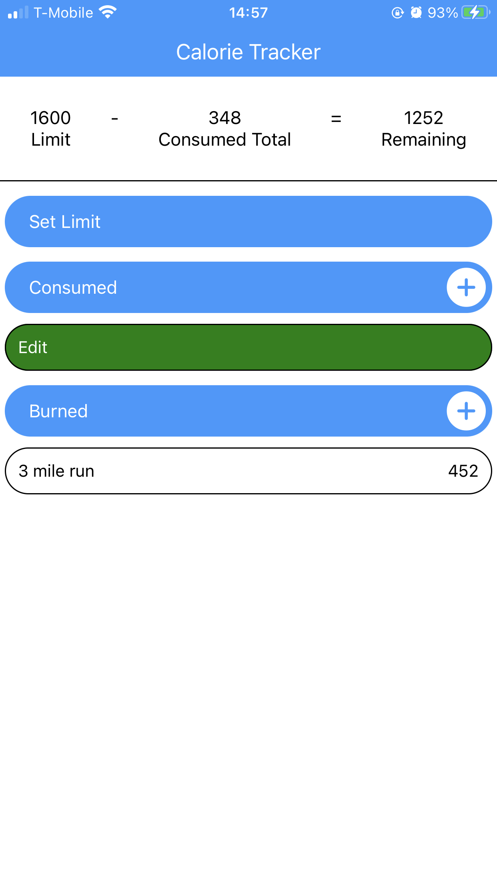

# CaloTrak

A simple lightweight react native app that helps with keeping track of your caloric intake. Calories in, calories out. No macro or micronutrient information provided. Useful for when you want to quickly log your meals and snacks without needing the details. Data is saved to your local device.

Get the app:

<a href="https://play.google.com/store/apps/details?id=com.aleton.CalorieTracker&pli=1">Google Play Store</a>

<a href="https://expo.dev/@aleton/CalTrak">Expo</a>

## Recommendations
You can use my app to quickly track caloric intake on any given day or any number of days. Personally, I find it useful to view my eating habits from a larger perspective. Instead of tracking calories for a single day, I prefer to use it in weekly intervals. For example, I would set my calorie limit for an entire week and keep track of my calories for that week. This way, instead of becoming demoralized by having an "off" day during the week as I often do (I like food), I can clearly see how far I am from my limit for the rest of the week and adjust accordingly.

## Initial State
The app will start with a clean slate without any data. The equation will be show the variables all set to 0. The calorie panel will display 3 buttons ("set limit", "consumed", and "burned", respectively) without any additional data.

    

## Setting a Limit
Pressing the "set limit" button will enable you to set a new value for your maximum caloric intake. You should notice the change take effect in the equation.

    
    

## Adding Consumed Calories
Pressing the "consumed" button will open up a modal that allows you to add consumed calories. Consumed calories are subtracted from your limit.

    
    

## Adding Burned Calories
Pressing the "consumed" button will open up a modal that allows you to add consumed calories. Burned calories are added to your limit.

    
    

## Consumed Total
Press the equation to view the combined value of calories consumed and calories burned. Press again to return to the original equation.

    

## Editing Calories
Swipe from left to right on a calorie element and press the 'edit' button to modify the item's values.

    

## Removing Calories
Swipe from right to left on a calorie element and press the 'remove' button to remove it.

    

## Changing Calorie Type
When clicking "consumed" or "burned", a modal will automatically select the corresponding type. If you wish to change it, select the other type from the dropdown menu.

    

